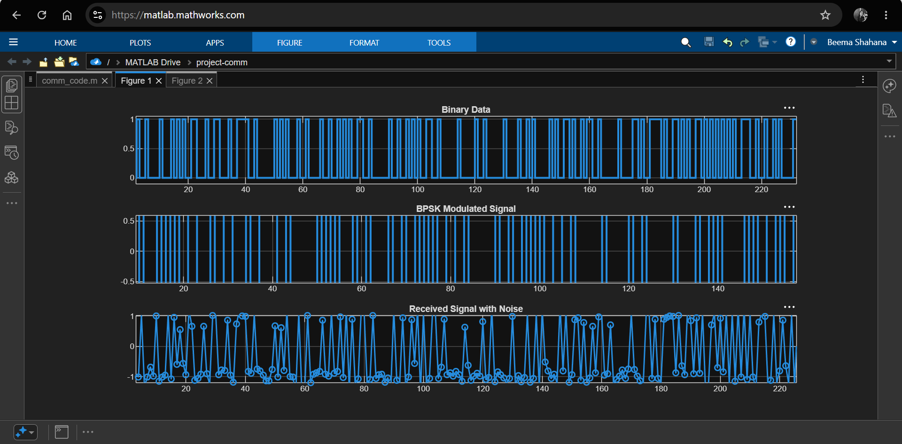
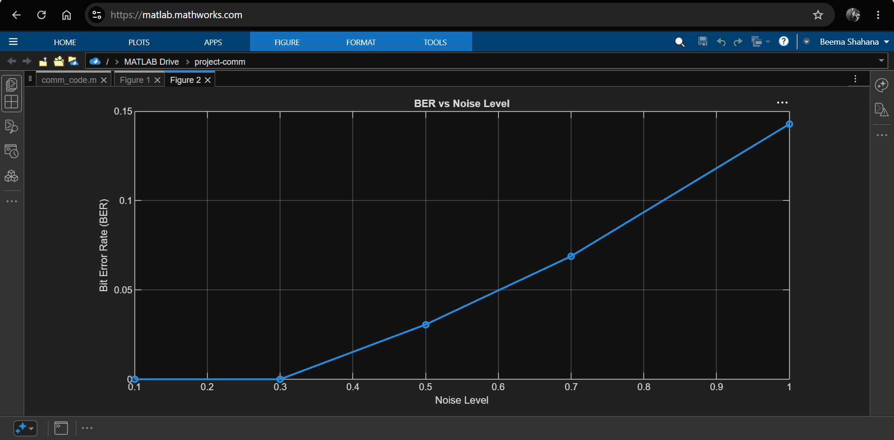
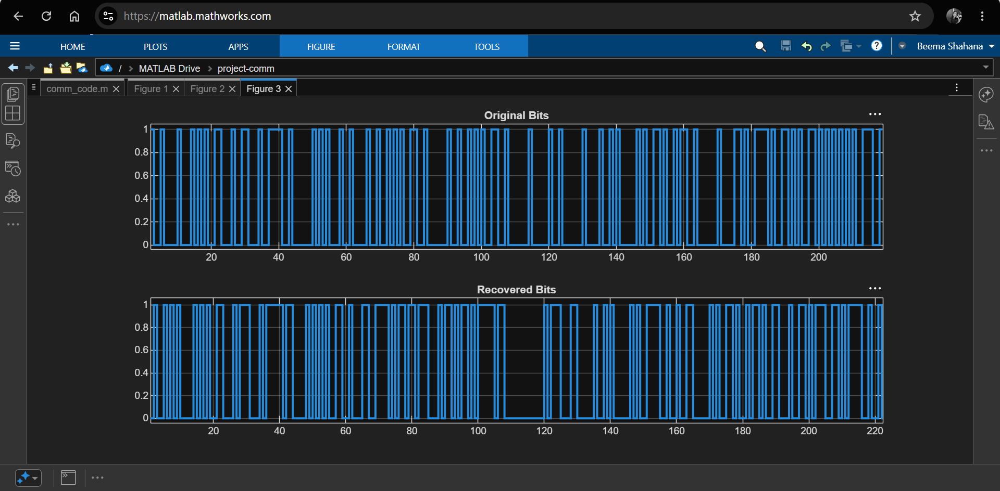

# BPSK Communication System Simulation using MATLAB

## Overview

This project demonstrates the implementation of a Binary Phase Shift Keying (BPSK) digital communication system using MATLAB.

The system performs end-to-end communication by converting a text message into binary data, modulating it using BPSK, transmitting it through a noisy channel, recovering the received signal, and evaluating system performance using Bit Error Rate (BER).

---

## Features

* Text to binary conversion
* BPSK modulation
* Additive White Gaussian Noise (AWGN) channel simulation
* Signal demodulation and bit recovery
* Message reconstruction
* Bit Error Rate (BER) calculation
* BER analysis under different noise levels
* Signal visualization using MATLAB plots

---

## System Flow

Text Message

↓

Binary Conversion

↓

BPSK Modulation

↓

Noise Channel (AWGN)

↓

Demodulation

↓

Recovered Bits

↓

Recovered Message

↓

BER Analysis

---

## Results

### BPSK Modulation and Transmission

### BER Performance

### Bit Recovery

### Transmission Process

* Original binary data
* BPSK modulated signal
* Received noisy signal

### Demodulation Results

* Comparison between original bits and recovered bits
* Error detection and BER calculation

### Performance Analysis

BER is evaluated for different noise levels to study the robustness of the communication system.

---

## Technologies Used

* MATLAB
* Digital Communication Concepts
* BPSK Modulation
* Signal Processing

---

## Future Improvements

* QPSK implementation
* Theoretical vs simulated BER comparison
* Constellation diagrams
* GUI-based visualization
* SNR-based performance analysis

---

## Author

**Beema Shahana Shiyad**

B.Tech Electronics and Communication Engineering
